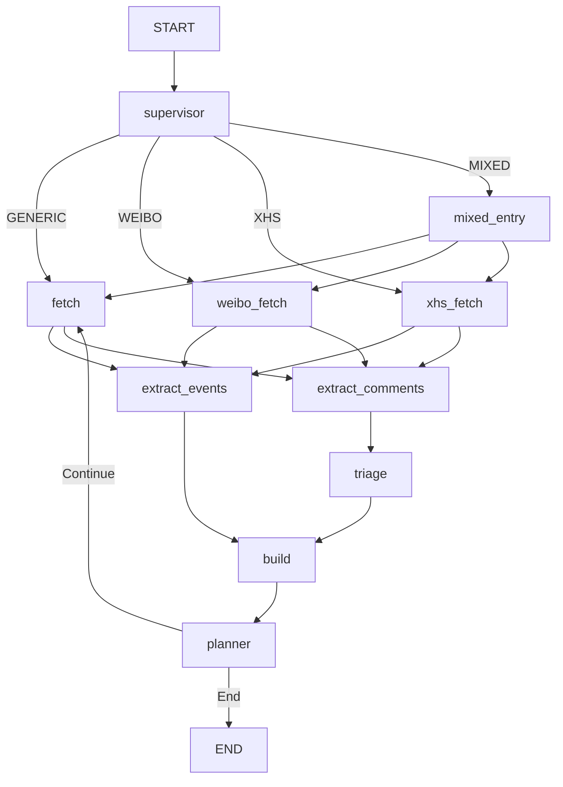

## 架构说明（Architecture）

### 1. 架构风格选择

本项目采用 **模块化单体 + LangGraph 状态机** 的架构风格：

- **单体应用**：所有逻辑在一个代码仓库内运行，通过清晰的模块划分控制复杂度。
- **LangGraph 编排**：利用 StateGraph 控制事件分析流程，支持条件跳转、并行执行与多轮迭代。

### 2. 模块划分与职责

项目主目录（src/）按“领域 + 职责”划分为以下模块：

```text
src/
  config/           # 配置管理（模型、API Key、平台开关等）

  core/             # 领域模型 & 纯业务逻辑
    models/
      evidence.py   # 证据数据结构
      events.py     # 事件节点 / 未解决问题
      timeline.py   # 时间线结构
      comments.py   # 评论与打分模型
      strategy.py   # 搜索策略枚举 (Generic/Weibo/XHS/Mixed)

  fetchers/         # 外部数据源抓取
    base.py         # Fetcher 接口
    serpapi_fetcher.py # 基于 SerpAPI 的通用/特定站点搜索
    weibo_fetcher.py   # 微博专用 Fetcher (site:weibo.com)
    xhs_fetcher.py     # 小红书专用 Fetcher (site:xiaohongshu.com)

  agents/           # LangGraph 节点逻辑
    supervisor.py         # [New] 意图识别与路由分发
    event_extractor.py    # 事件抽取 & 去重
    comment_extractor.py  # [New] 深度评论挖掘
    comment_triage.py     # 评论打分与晋升
    retrieval_planner.py  # 检索规划
    timeline_deduplicator.py # [New] 跨平台语义去重与融合
    report_writer.py      # 叙事性报告生成

  graph/            # LangGraph 编排
    workflow.py          # 图结构定义 (Supervisor -> Fetchers -> Extract -> Build -> Plan)
    nodes/               # 各节点具体实现
      supervisor_node.py
      platform_fetch_nodes.py
      extract_node.py    # [New] 并行提取 (Events & Comments)

  interface/        # 对外入口
    cli.py               # 命令行入口
```

### 3. GraphState 与主流程概览

#### GraphState
核心状态字段：
* `query`: 用户初始问题
* `search_strategy`: 当前检索策略 (GENERIC / WEIBO / XHS / MIXED)
* `evidences`: 累积的证据集合
* `timeline`: 构建出的事件时间线
* `retrieval_plan`: 下一步检索计划
* `loop_step`: 当前迭代轮次

#### 主流程 (Topology)



1.  **Supervisor**: 分析用户意图，决定是走通用搜索还是特定平台（或混合模式）。
2.  **Fetchers (Parallel)**: 根据策略并行执行搜索。
3.  **Extract (Parallel)**: 
    *   `extract_events`: 从正文中提取事件，执行 **Layer 1 去重** (URL/Title)。
    *   `extract_comments`: 从正文中挖掘评论与观点 (支持 25k 字符上下文)。
4.  **Triage**: 对提取的评论进行打分，高分评论晋升为证据。
5.  **Build**: 
    *   构建时间线。
    *   执行 **Layer 2 去重** (语义融合): 使用 LLM 将多源事件融合 (News Backbone + Social Perspectives)。
6.  **Planner**: 分析当前时间线缺口，生成下一轮检索计划。

### 4. 关键特性

*   **跨平台融合**: 支持 News 与 Social 信息的语义级融合。
*   **深度挖掘**: 支持从长文本 (25k chars) 中挖掘被淹没的评论与观点。
*   **智能路由**: 自动识别 "Sora 微博 评论" 等意图并切换策略。
